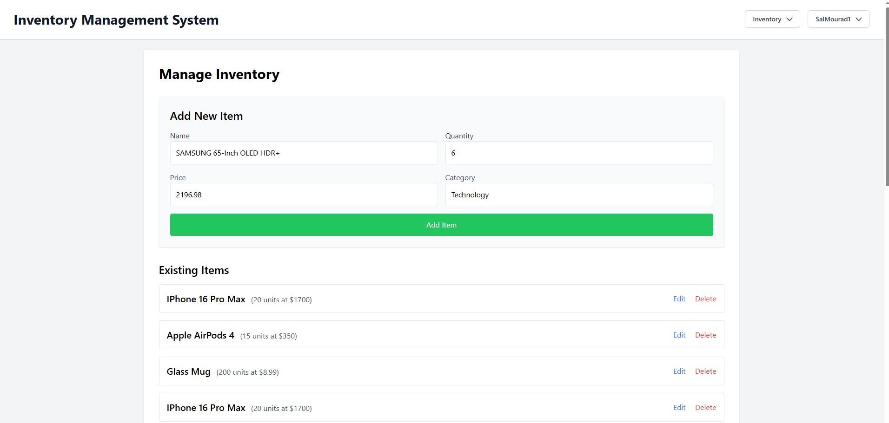

# Assignment 3: Inventory Management System

## Part 1: Project Plan

### Description
The Inventory Management System is designed to support with inventory control for small businesses and warehouses. It features a centralized platform for tracking stock levels, managing supplier information and processing orders efficiently. With user-friendly interfaces and robust CRUD functionalities, the system aims to reduce overall manual errors and support informed decision making. 

### Main Features
- CRUD Operations:
    - Create, Read, Update, Delete functionalities for inventory items
    - CRUD operations for managing suppliers and cetegories

- User Interface
    - A modern web interface for managing items and viewing inventory
    - A simple and intuitive dashboard to display stock levels and alerts

- Authentication & Authorization
    - User registration, login, and role-based access

- Search and Pagenation
    - Ability to search items based on name, category, or supplier
    - List view with pagination for easy browsing

- Time-Permitting Features
    - Real time updates on inventory changes
    - Reporting and analytics features 

### Database Schema Design (ERD)

### Database Schema Design Decisions
#### The DB contains four main entities
- Category: 
  - Stores category details (name, description, created_at). 
  - Each category can have multiple inventory items, establishing a one-to-many relationship with InventoryItem.
- InventoryItem: 
  - Contains details about individual items (name, description, quantity, price, created_at, updated_at) and links to a category via a foreign key. It also tracks which user created the item through a foreign key to the User table.
- Supplier: 
  - Manages supplier information. Since an item can be supplied by multiple suppliers and vice-versa, we use a many-to-many relationship between InventoryItem and Supplier, managed via the ItemSupplier join table.
- User: 
  - Contains user credentials (username, password, role) and the creation timestamp. Each user can create multiple inventory items.

#### Design Choices
- Keys: 
  - Each table has a unique primary key and proper foreign keys to maintain data integrity.
- Timestamps: 
  - Timestamps are set dynamically using datetime.now(timezone.utc).
- Relationships: 
  - A join table (ItemSupplier) manages the many-to-many relationship between items and suppliers.
- User Security: 
  - The User table enforces unique usernames and stores passwords securely.

### API Endpoints Structure

#### Inventory Items
- List all inventory items:  
  `GET /items`
- Retrieve details for a single inventory item:  
  `GET /items/{item_id}`
- Create a new inventory item:  
  `POST /items`
- Update an existing inventory item:  
  `POST /items/{item_id}`
- Remove an inventory item from the system:  
  `DELETE /items/{item_id}`

---

#### Suppliers
- List all suppliers:  
  `GET /suppliers`
- Retrieve details for a single supplier:  
  `GET /suppliers/{supplier_id}`
- Add a new supplier:  
  `POST /suppliers`
- Update an existing supplier:  
  `POST /suppliers/{supplier_id}`
- Delete a supplier:  
  `DELETE /suppliers/{supplier_id}`

---

#### Categories
- List all categories:  
  `GET /categories`
- Retrieve details for a single category:  
  `GET /categories/{category_id}`
- Create a new category:  
  `POST /categories`
- Update an existing category:  
  `POST /categories/{category_id}`
- Delete a category:  
  `DELETE /categories/{category_id}`

---

#### User Authentication & Authorization
- Register a new user:  
  `POST /auth/register`
- Log in an existing user:  
  `POST /auth/login`
- Get profile of logged-in user:  
  `GET /auth/profile`
- (Admin-only) Access admin-protected endpoint:  
  `GET /auth/admin`

## Key Interfaces In UI
### Home Page

### Login Page

### Registration Page

### User Profile

### Inventory Management Dashboard

### Edit Inventory (Inside Inventory Management Dashboard)

### View Inventory Dashboard

