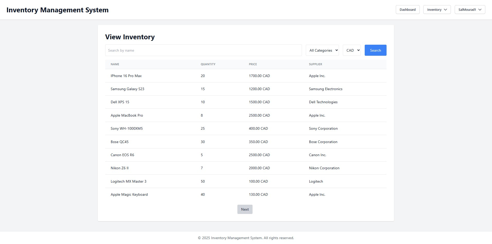
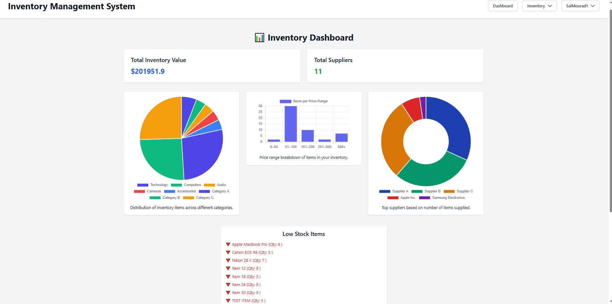

# Inventory Management System

## Setup and Installation

### 📥 Clone the Repository

You can clone the project from either GitHub or GitLab:

#### GitHub:
```bash
git clone https://github.com/sal218/inventory-hub-fastapi.git
# or using SSH
git clone git@github.com:sal218/inventory-hub-fastapi.git
```
#### GitLab (UFV):
```bash
git clone https://sc-gitlab.ufv.ca/202501comp351on1/sa95/project.git
# or using SSH
git clone git@sc-gitlab.ufv.ca:202501comp351on1/sa95/project.git
```

### 🛠️ Build the Docker image

```bash
docker-compose build
``` 
### ▶️ Start Container 
```bash
docker-compose up
```
### 🌐 Access The WebApp
```bash
http://localhost:8500/
```

---

### ⚙️ Environment Configuration

This project uses a `.env` file to store sensitive credentials and configuration variables.

#### ✅ Required Environment Variables

| Variable Name          | Description                                                             |
|------------------------|-------------------------------------------------------------------------|
| `SECRET_KEY`           | Used to sign JWT tokens for secure authentication                      |
| `GOOGLE_CLIENT_ID`     | Google OAuth 2.0 client ID (for login with Google)                      |
| `GOOGLE_CLIENT_SECRET` | Google OAuth 2.0 client secret (for login with Google)                  |

---

### 📄 .env File

Create a `.env` file in the **root of the project directory** (same level as `docker-compose.yml`) and add the following:

```env
SECRET_KEY=your_very_secret_key_here
GOOGLE_CLIENT_ID=your_google_oauth_client_id
GOOGLE_CLIENT_SECRET=your_google_oauth_client_secret
```
### 📦 .env.example
To help other developers get started quickly, a .env.example file is included in the repo.
It contains the structure and placeholder values for required variables:
```env
SECRET_KEY=your_secret_key_here
GOOGLE_CLIENT_ID=your_google_client_id_here
GOOGLE_CLIENT_SECRET=your_google_client_secret_here
```
Developers should copy this file and rename it to `.env`

## 🗺️ Project Plan

### 📝 Description
The Inventory Management System is designed to streamline inventory control for small businesses, warehouses, and retail teams. It provides a centralized platform to track stock levels, manage supplier and category information, view insightful dashboards, and process inventory efficiently. Built with FastAPI and a modern web frontend, the system emphasizes usability, security, and extendability.

---

### 🌟 Main Features

#### ✅ CRUD Operations
- Full Create, Read, Update, Delete support for:
  - Inventory items
  - Suppliers
  - Categories

#### ✅ User Interface
- Clean and responsive web interface using Jinja2 + Tailwind CSS
- Inventory management pages (Admin and User views) 
- Dedicated pages for managing and viewing inventory
- Dark mode theme for enhanced user experience (assignment 4 update)
- Intutitive dynamic dashboard 

#### ✅ Dashboard with Visual Insights (Assignment 4 update)
- 📊 Inventory dashboard displaying:
  - Total inventory value
  - Unique and top suppliers
  - Category breakdown via pie chart
  - Price distribution via bar chart
  - Low stock alerts
  - Recently added items
- Powered by **Chart.js** with a clean Tailwind UI
- `/dashboard` route with server-rendered stats + frontend dynamic charts

#### ✅ Authentication & Authorization
- Secure login and registration with password hashing
- Cookie-based JWT authentication
- Google OAuth 2.0 SSO login integration
- Role-based access control (Admin vs Regular)

#### ✅ Search & Pagination
- Inventory item search by:
  - Name
  - Category
  - Supplier
- Page-by-page browsing with pagination controls

#### ✅ API with OpenAPI Support
- RESTful API endpoints for all core resources
- OpenAPI docs at `/docs` for easy testing and development
- Includes `/api/dashboard` endpoints for summary and low stock API

---

### 🚀 Time-Permitting / Future Features 

- 🟡 **Category CRUD Completion**  
  Enhance category editing and viewing experience

- 🟡 **Real-Time Inventory Updates**  
  WebSocket or polling-based updates for changes without page refresh

- 🟡 **Advanced Reporting & Analytics**  
  Exportable reports (CSV, PDF), deeper analytics for trends over time

- 🟡 **Inventory History Logs**  
  Track when items are added, edited, or deleted for audit trail

---

### 🛠️ Tech Stack
- **Backend**: FastAPI + SQLAlchemy
- **Frontend**: Jinja2 + Tailwind CSS + Chart.js
- **Database**: SQLite (for development)
- **Auth**: JWT + Google OAuth 2.0
- **Containerization**: Docker + Docker Compose


## Database Schema Design (ERD)


## Database Schema Design Decisions
#### The DB contains four main entities
- Category: 
  - Stores category details (name, description, created_at). 
  - Each category can have multiple inventory items, establishing a one-to-many relationship with InventoryItem.
- InventoryItem: 
  - Contains details about individual items (name, description, quantity, price, created_at, updated_at) and links to a category via a foreign key. It also tracks which user created the item through a foreign key to the User table.
- Supplier: 
  - Manages supplier information. Since an item can be supplied by multiple suppliers and vice-versa, we use a many-to-many relationship between InventoryItem and Supplier, managed via the ItemSupplier join table.
- User: 
  - Contains user credentials (username, password, role) and the creation timestamp. Each user can create multiple inventory items.

#### Design Choices
- Keys: 
  - Each table has a unique primary key and proper foreign keys to maintain data integrity.
- Timestamps: 
  - Timestamps are set dynamically using datetime.now(timezone.utc).
- Relationships: 
  - A join table (ItemSupplier) manages the many-to-many relationship between items and suppliers.
- User Security: 
  - The User table enforces unique usernames and stores passwords securely.


## 📚 API Documentation

All endpoints return JSON responses and follow RESTful conventions.

### 🔐 Authentication
> Some routes are protected and require a valid JWT token in the `Authorization` header as:  
> `Authorization: Bearer <token>`

---

### 📦 Inventory Items

| Method | Endpoint               | Description                            |
|--------|------------------------|----------------------------------------|
| GET    | `/items`               | List all inventory items               |
| GET    | `/items/{item_id}`     | Retrieve details of a single item      |
| POST   | `/items`               | Create a new inventory item            |
| POST   | `/items/{item_id}`     | Update an existing inventory item      |
| DELETE | `/items/{item_id}`     | Delete an inventory item               |

---

### 🚚 Suppliers

| Method | Endpoint                    | Description                      |
|--------|-----------------------------|----------------------------------|
| GET    | `/suppliers`                | List all suppliers               |
| GET    | `/suppliers/{supplier_id}`  | Get supplier details             |
| POST   | `/suppliers`                | Add a new supplier               |
| POST   | `/suppliers/{supplier_id}`  | Update an existing supplier      |
| DELETE | `/suppliers/{supplier_id}`  | Delete a supplier                |

---

### 🗂️ Categories

| Method | Endpoint                     | Description                        |
|--------|------------------------------|------------------------------------|
| GET    | `/categories`                | List all categories                |
| GET    | `/categories/{category_id}`  | Retrieve category details          |
| POST   | `/categories`                | Create a new category              |
| POST   | `/categories/{category_id}`  | Update an existing category        |
| DELETE | `/categories/{category_id}`  | Delete a category                  |

---

### 👤 User Authentication

| Method | Endpoint          | Description                           |
|--------|-------------------|---------------------------------------|
| POST   | `/auth/register`  | Register a new user                   |
| POST   | `/auth/login`     | Log in and retrieve access token      |
| GET    | `/auth/profile`   | Get the current user's profile        |
| GET    | `/auth/admin`     | Admin-only protected route            |

---
### 🖥️ UI-Based Routes (HTML Pages)

These routes serve the frontend HTML pages using Jinja2 templates and manage authentication via cookies.

| Method | Endpoint                  | Description                                |
|--------|---------------------------|--------------------------------------------|
| GET    | `/`                       | Home page                                  |
| GET    | `/login`                  | Login page (form)                          |
| POST   | `/login`                  | Submit login credentials                   |
| GET    | `/register`               | Registration page                          |
| POST   | `/register`               | Submit registration form                   |
| GET    | `/logout`                 | Logout (clears token and redirects to login) |
| GET    | `/profile`                | Authenticated user’s profile page          |

---

### 📋 Inventory Management (UI)

| Method | Endpoint                         | Description                                     |
|--------|----------------------------------|-------------------------------------------------|
| GET    | `/inventory/manage`              | View all inventory items (admin UI)             |
| GET    | `/inventory/view`                | Browse/search inventory (user-facing UI)        |
| POST   | `/inventory/add`                 | Add a new inventory item via UI form            |
| POST   | `/inventory/edit/{item_id}`      | Edit an existing inventory item via UI form     |
| GET    | `/inventory/delete/{item_id}`    | Delete an inventory item from UI                |

### 📊 Dashboard (UI + API) (Assignment 4 update)

| Method | Endpoint                 | Description                                              |
|--------|--------------------------|----------------------------------------------------------|
| GET    | `/dashboard`             | Authenticated dashboard with charts and metrics (UI)     |

---

### 📈 Dashboard API Endpoints (Assignment 4 update)

| Method | Endpoint                     | Description                                      |
|--------|------------------------------|--------------------------------------------------|
| GET    | `/api/dashboard/summary`     | Returns total inventory value and item count     |
| GET    | `/api/dashboard/low-stock`   | Returns low stock items (quantity < 10)          |

---

### 🔐 OAuth2 Authentication (Google) (Assignment 4 update)

| Method | Endpoint                      | Description                                      |
|--------|-------------------------------|--------------------------------------------------|
| GET    | `/auth/google/login`          | Redirects user to Google login screen            |
| GET    | `/auth/google/callback`       | Handles callback and logs user in via JWT token  |
> 🛑 Most of these routes require login via cookies. Accessing them without authentication will redirect you to the login page.

### 🎮 Client Demo — Using the API
---

This project includes a **fully functional HTML client** (built with Jinja2 and served by FastAPI) that **demonstrates real usage of the API** through:

- ✅ **User Authentication** — Register/Login through UI forms  
- ✅ **Inventory Management** — Add, edit, delete items using form inputs  
- ✅ **Dynamic Data Rendering** — View inventory, search, filter by category  
- ✅ **Analytics Dashboard** — Visualizes data from API using Chart.js (e.g., top categories, price buckets, suppliers)

You can interact with these features at:

| UI Page                     | Description                                         |
|----------------------------|-----------------------------------------------------|
| `/login`, `/register`      | Authenticates users with forms                     |
| `/inventory/manage`        | Uses API to manage inventory items                 |
| `/inventory/view`          | Shows searchable inventory via API queries         |
| `/dashboard`               | Visualizes data using chart-powered API responses  |

---

### 🔧 Example: API in Action

These UI routes rely on underlying API calls like:

```http
GET /api/dashboard/summary
GET /api/dashboard/low-stock
``` 
You can also test these directly via:
```bash
curl -X GET http://localhost:8500/api/dashboard/summary \
  --cookie "access_token=<your_token_here>"

```

### 🧪 Interactive API Docs

Once the app is running, you can view and test all API endpoints using OpenAPI Specification at:

**[http://localhost:8500/docs](http://localhost:8500/docs)**  

or use curl:   
```bash
curl -X 'GET' 'http://localhost:8500/docs'
```
## ✨ Integration Added (Assignment 4 Update)
### Currency Exchange API 
**API Utilized:** Frankfurter<br>
**Use Case:**  Helps international users view product prices in their local currency. Users can change the price dynamically (which defaults to CAD) to one of the following currencies: <br>
1. CAD
2. USD
3. EUR
4. GBP
---
## 🔐 Google Single Sign-On (SSO) Integration (Assignment 4 Update)

This project supports secure Google Single Sign-On (OAuth2) for user authentication.

### How It Works
- Users can click **"Sign in with Google"** on the login page to authenticate via their Google account.
- Upon successful login, a secure JWT is issued and stored as an HTTP-only cookie.
- If the user is new, a corresponding user record is automatically created with a default "Regular" role.

### Configuration
To enable Google SSO, make sure your `.env` file includes the following variables:

```env
GOOGLE_CLIENT_ID=your-google-client-id
GOOGLE_CLIENT_SECRET=your-google-client-secret
REDIRECT_URI=http://localhost:8500/auth/google/callback
```
Google SSO enhances user experience and provides a secure, passwordless authentication option.

**Important:** The `REDIRECT_URI` must also be registered in your Google Cloud Console for the OAuth2 credentials.


## Key Interfaces In UI
### Home Page


### Login Page (Updated image for Assingment 4)


### Registration Page


### User Profile (Updated image for Assignment 4)


### Inventory Management Page


### Edit Inventory (Inside Inventory Management Page) 


### View Inventory Page


### Inventory Dashboard (Updated For Assignment 4)


### Dark Mode Images (Three Sample images)

### User Profile  (Updated image for Assignment 4)


### Inventory Dashboard (Updated For Assignment 4)


### Inventory Management Page


