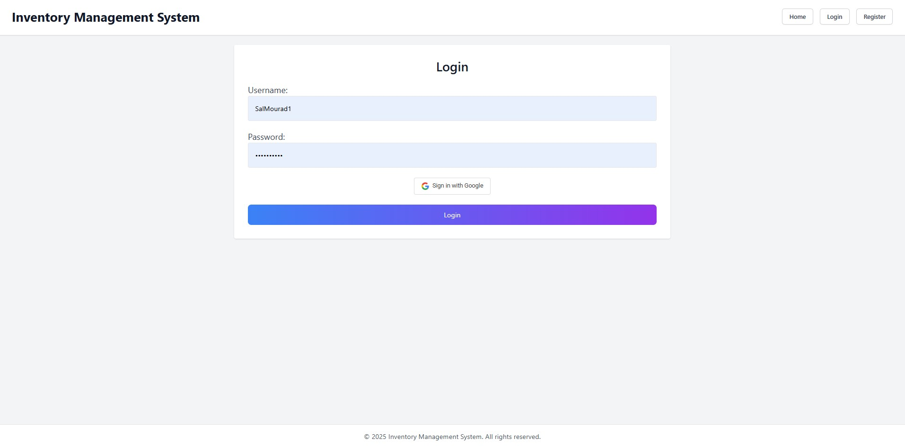
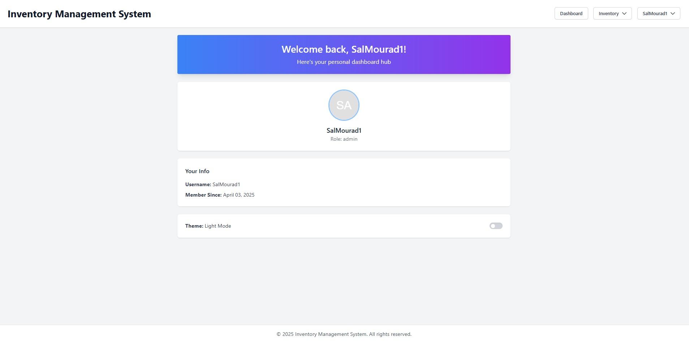

# Assignment 3: Inventory Management System

## Setup and Installation
###  Build the Docker image

```bash
docker-compose build
``` 
### Start Container 
```bash
docker-compose up
```
### Access The WebApp
```bash
http://localhost:8500
```

## Project Plan

### Description
The Inventory Management System is designed to support with inventory control for small businesses and warehouses. It features a centralized platform for tracking stock levels, managing supplier information and processing orders efficiently. With user-friendly interfaces and robust CRUD functionalities, the system aims to reduce overall manual errors and support informed decision making. 

## Main Features
- CRUD Operations:
    - Create, Read, Update, Delete functionalities for inventory items
    - CRUD operations for managing suppliers and cetegories (Not Yet Fully Complete - Leaving for Assignment 4 contituation)

- User Interface
    - A modern web interface for managing items and viewing inventory
    - A simple and intuitive dashboard to display stock levels and alerts (Not Yet Complete - Leaving for Assignment 4 contituation)

- Authentication & Authorization
    - User registration, login, and role-based access

- Search and Pagenation
    - Ability to search items based on name, category, or supplier
    - List view with pagination for easy browsing

- Time-Permitting Features
    - Real time updates on inventory changes (Not Yet Complete - Leaving for Assignment 4 contituation)
    - Reporting and analytics features  (Not Yet Complete - Leaving for Assignment 4 contituation)


## Database Schema Design (ERD)


## Database Schema Design Decisions
#### The DB contains four main entities
- Category: 
  - Stores category details (name, description, created_at). 
  - Each category can have multiple inventory items, establishing a one-to-many relationship with InventoryItem.
- InventoryItem: 
  - Contains details about individual items (name, description, quantity, price, created_at, updated_at) and links to a category via a foreign key. It also tracks which user created the item through a foreign key to the User table.
- Supplier: 
  - Manages supplier information. Since an item can be supplied by multiple suppliers and vice-versa, we use a many-to-many relationship between InventoryItem and Supplier, managed via the ItemSupplier join table.
- User: 
  - Contains user credentials (username, password, role) and the creation timestamp. Each user can create multiple inventory items.

#### Design Choices
- Keys: 
  - Each table has a unique primary key and proper foreign keys to maintain data integrity.
- Timestamps: 
  - Timestamps are set dynamically using datetime.now(timezone.utc).
- Relationships: 
  - A join table (ItemSupplier) manages the many-to-many relationship between items and suppliers.
- User Security: 
  - The User table enforces unique usernames and stores passwords securely.


## 📚 API Documentation

All endpoints return JSON responses and follow RESTful conventions.

### 🔐 Authentication
> Some routes are protected and require a valid JWT token in the `Authorization` header as:  
> `Authorization: Bearer <token>`

---

### 📦 Inventory Items

| Method | Endpoint               | Description                            |
|--------|------------------------|----------------------------------------|
| GET    | `/items`               | List all inventory items               |
| GET    | `/items/{item_id}`     | Retrieve details of a single item      |
| POST   | `/items`               | Create a new inventory item            |
| POST   | `/items/{item_id}`     | Update an existing inventory item      |
| DELETE | `/items/{item_id}`     | Delete an inventory item               |

---

### 🚚 Suppliers

| Method | Endpoint                    | Description                      |
|--------|-----------------------------|----------------------------------|
| GET    | `/suppliers`                | List all suppliers               |
| GET    | `/suppliers/{supplier_id}`  | Get supplier details             |
| POST   | `/suppliers`                | Add a new supplier               |
| POST   | `/suppliers/{supplier_id}`  | Update an existing supplier      |
| DELETE | `/suppliers/{supplier_id}`  | Delete a supplier                |

---

### 🗂️ Categories

| Method | Endpoint                     | Description                        |
|--------|------------------------------|------------------------------------|
| GET    | `/categories`                | List all categories                |
| GET    | `/categories/{category_id}`  | Retrieve category details          |
| POST   | `/categories`                | Create a new category              |
| POST   | `/categories/{category_id}`  | Update an existing category        |
| DELETE | `/categories/{category_id}`  | Delete a category                  |

---

### 👤 User Authentication

| Method | Endpoint          | Description                           |
|--------|-------------------|---------------------------------------|
| POST   | `/auth/register`  | Register a new user                   |
| POST   | `/auth/login`     | Log in and retrieve access token      |
| GET    | `/auth/profile`   | Get the current user's profile        |
| GET    | `/auth/admin`     | Admin-only protected route            |

---
### 🖥️ UI-Based Routes (HTML Pages)

These routes serve the frontend HTML pages using Jinja2 templates and manage authentication via cookies.

| Method | Endpoint                  | Description                                |
|--------|---------------------------|--------------------------------------------|
| GET    | `/`                       | Home page                                  |
| GET    | `/login`                  | Login page (form)                          |
| POST   | `/login`                  | Submit login credentials                   |
| GET    | `/register`               | Registration page                          |
| POST   | `/register`               | Submit registration form                   |
| GET    | `/logout`                 | Logout (clears token and redirects to login) |
| GET    | `/profile`                | Authenticated user’s profile page          |

---

### 📋 Inventory Management (UI)

| Method | Endpoint                         | Description                                     |
|--------|----------------------------------|-------------------------------------------------|
| GET    | `/inventory/manage`              | View all inventory items (admin UI)             |
| GET    | `/inventory/view`                | Browse/search inventory (user-facing UI)        |
| POST   | `/inventory/add`                 | Add a new inventory item via UI form            |
| POST   | `/inventory/edit/{item_id}`      | Edit an existing inventory item via UI form     |
| GET    | `/inventory/delete/{item_id}`    | Delete an inventory item from UI                |

> 🛑 Most of these routes require login via cookies. Accessing them without authentication will redirect you to the login page.

### 🧪 Interactive API Docs

Once the app is running, you can view and test all API endpoints using OpenAPI Specification at:

**[http://localhost:8500/docs](http://localhost:8500/docs)**  

or use curl:  
```bash
curl -X 'GET' 'http://localhost:8500/docs'
```


## Key Interfaces In UI
### Home Page


### Login Page


### Registration Page


### User Profile


### Inventory Management Dashboard


### Edit Inventory (Inside Inventory Management Dashboard)


### View Inventory Dashboard


